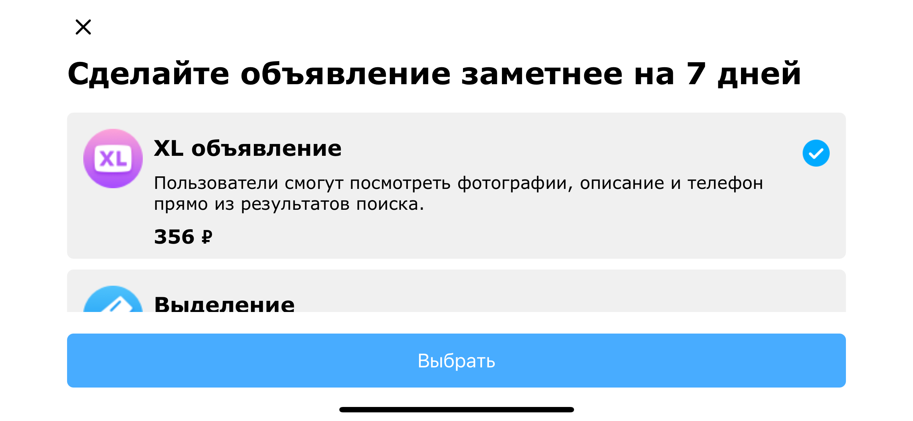
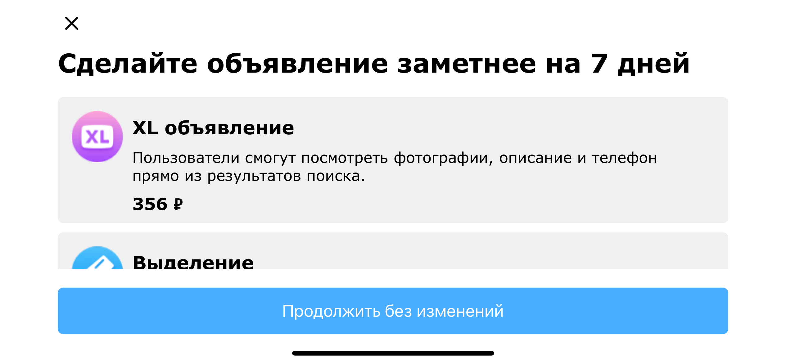

# Task for avito iOS internship in VAS unit 2021

### Что нужно сделать:
- Реализовать экран в соответствии с примером [макета](https://github.com/avito-tech/internship/blob/main/screen.png). Отступы, шрифты - на глаз по картине
- Данные для экрана парсить из [json файла](https://github.com/avito-tech/internship/blob/main/result.json)

### Логика взаимодействия:
- Элементы на сером фоне из примера и кнопка "Выбрать" кликабельные, крестик нет
- При нажатии на элемент он выделяется (отмечается синей галочкой) или отменяется
- Одновременно может быть отмечен только один элемент
- При нажатии кнопки выбора показывается алерт с названием выбраной услуги

### Не рекомендуется:
 - использовать внешние зависимости
 - использовать SwiftUI

### Будет плюсом:
+ не использовать Storyboard
+ заюзать UICollectionView
+ VIPER

### Результаты:
- Ручная верстка без использования storyboard
- Использование UICollectionView, динамичный размер ячеек в зависимости от контента, ориентации устройства и размера экрана
- VIPER

### Уточнения:
В задании не было указано, что делать в случае, если в файле сразу несколько элементов считаются выбранными, в то время, как в задании сказано, что одновременно может быть отмечен только один элемент. В подобном случае выбранной считается первая встреченная ячейка с isSelected = true, остальным же элементам со значением поля isSelected = true присваивается isSelected = false, также печатается предупреждение о том, что найден более чем один отмеченный элемент.

### Примеры работы:
 

  
